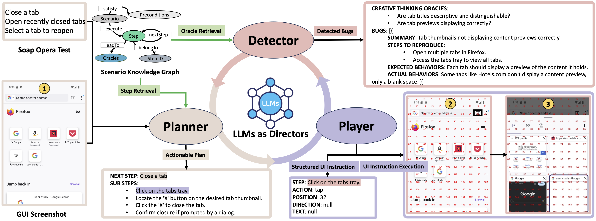
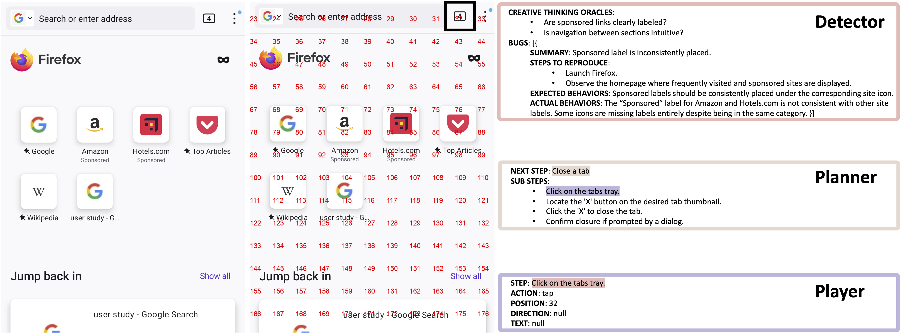
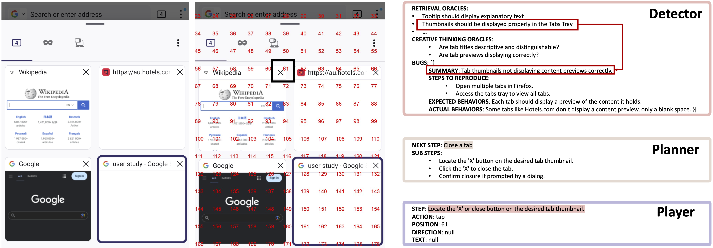
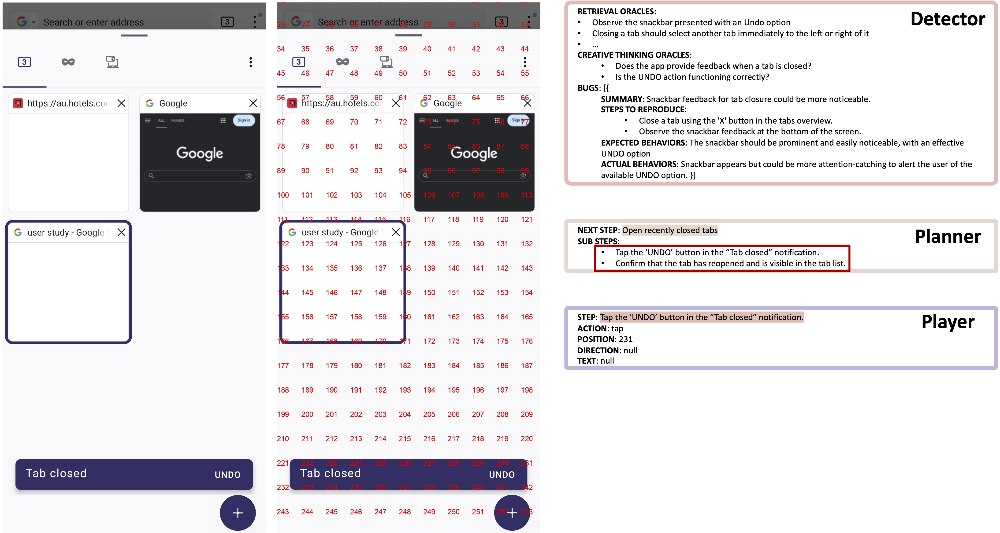
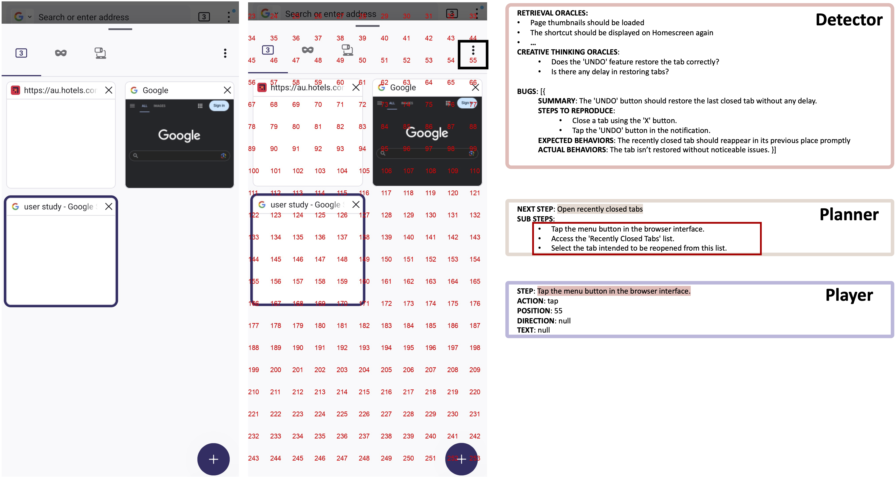
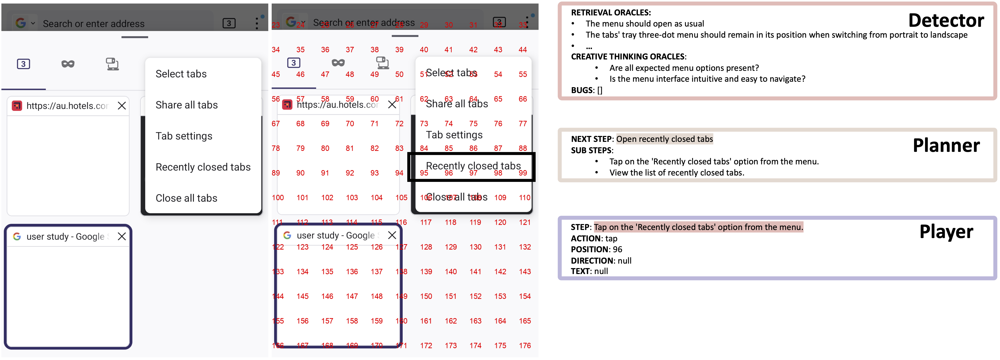
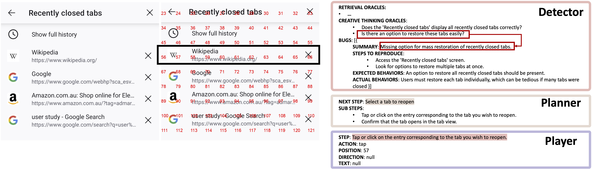
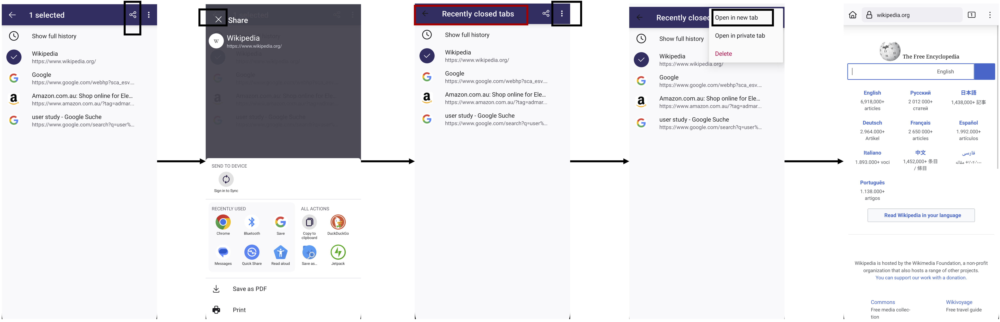

**Dataset:** https://drive.google.com/drive/folders/11GY5JZ4F_h40qsO_PdEAnNisnI-RtSd0?usp=sharing
1. Soap opera tests used for the formative study and automated soap opera testing.
2. Bug reports for Firefox used to construct the scenario knowledge graph.
3. Issues and pull requests for WordPress used to construct the scenario knowledge graph.
4. Issues and pull requests for AntennaPod used to construct the scenario knowledge graph.

**Code:**
1. Use scripts/0_0 to 0_3 to crawl bug reports from Mozilla Bugzilla.
2. Use scripts/1_1 to 1_3 to crawl issues and pull requests from GitHub.
3. Use scripts/2_1 to 2_8 to construct the scenario knowledge graph.
4. Set up a virtual Android device or connect a physical Android device to your computer.
5. Ensure the application under test is installed on the Android device.
6. Run scripts/app.py to execute the multi-agent system for automated soap opera testing.

### **Approach Overview of Automated Soap Opera Testing**

### **Example 1 by Automated Soap Opera Testing**

#### **Soap Opera Test**

**STEP 0**: Go to Subscriptions  
**STEP 1**: Click on the podcast to view the subscription episodes list  
**STEP 2**: Click on the menu icon  
**STEP 3**: Select 'Remove podcast'  
**STEP 4**: Confirm deletion  
**STEP 5**: Go to the player screen  
**STEP 6**: Click on the menu  
**STEP 7**: Select 'Open Podcast'

**Round 1-14**

Soap opera testing is a scenario-based exploratory testing (ET) approach designed to uncover unexpected behaviors through complex workflows and dramatic interactions.
Soap opera tests (test scenarios) typically involve realistic yet condensed system usage scenarios, which effectively reveal hidden and unexpected bugs. 
Without such soap opera tests as guidance, it is challenging for testers or traditional testing techniques to randomly generate and explore such intricate and dramatic workflows from scratch, making it difficult to identify these hidden issues.

In this example, the soap opera test involves removing a subscribed podcast and then attempting to open it on the player screen. 
This test spans different features (e.g., removing and opening a podcast) and multiple pages (e.g., Subscriptions and Player Screen), reflecting realistic yet condensed system usage scenarios. 
The exaggerated interactions in this test reveal a hidden issue: an infinitely spinning loader, as shown in the final pink box.
This bug only occurs after performing a sequence of intricate steps. 
Because the scenario involves a realistic yet condensed workflow spanning multiple features and pages, it is challenging for testers or traditional testing techniques to generate and explore such a dramatic scenario from scratch. 
Moreover, identifying this non-crash bug requires an understanding of the GUI state, adding another layer of difficulty for conventional detection methods.

**This example highlights the challenges of automating soap opera testing:**

1. **Automated Execution Challenge**:  
Soap opera tests involve long and intricate UI operations, making automation difficult. 
The Planner’s ability to detect deviations and dynamically adjust the plan (shown in the purple box) significantly increases the likelihood of successful test execution.

2. **Bug Detection Challenge**:  
Effective bug detection requires understanding the executed UI instructions (via NLU) and recognizing the resulting UI changes (via image recognition). 
With these capabilities, the Detector can reliably identify unexpected bugs (shown in the pink box).

### **Example 2 by Automated Soap Opera Testing**

#### **Soap Opera Test**

**STEP 0**: Close a tab  
**STEP 1**: Open recently closed tabs  
**STEP 2**: Select a tab to reopen  

**Round 1**

**Round 2**

The Detector identifies a bug based on the GUI status and oracle knowledge from SKG.

**Round 3**

The Planner generates an actionable plan to use the 'UNDO' feature, allowing for easy reopening of the closed tab based on the current GUI status.

**Round 4**

The Planner generates an actionable plan to open the 'Recently Closed Tabs' page by leveraging the current GUI status and step knowledge from the SKG.

**Round 5**

**Round 6**

**Round 7-11**

- The Planner generates an actionable plan to reopen the closed tab by selecting the Three-dot menu.  
- The Player, however, unexpectedly taps the 'Share' icon instead.  
- Recognizing this deviation, the Planner adjusts the plan to cancel the action by clicking the 'X' button.  
- This reveals a bug (Figure 3): the 'Back' icon turns black (making it hard to see), and the title reverts to 'Recently Closed Tabs' while still displaying the selected websites after canceling the share action.  
- The Planner resumes the intended steps and continues executing the plan until the soap opera test is successfully completed.

**From this example, the following insights can be observed:**

1. **Actionable Plan Generation**:  
   A single step in the soap opera test often requires executing multiple UI instructions. The Planner generates actionable plans based on the current GUI state and step knowledge from the SKG (e.g., round 1, round 4), increasing the likelihood of successfully completing the test.

2. **Adaptive Planning**:  
   The Planner dynamically adjusts plans based on the GUI state (e.g., round 3). When execution deviates from the intended path, the Planner can correct the deviation and resume the mainline execution (e.g., round 7-11), ensuring the test is completed.

3. **Non-Intrusive UI Operation Execution**:  
   The Player locates UI elements using grid numbers, a non-intrusive method that enhances the adaptability and generalizability of our approach across different applications.

4. **Exploration Beyond Test**:  
   Deviations from the main test path can lead to unexpected discoveries. Similar to role-playing games where side quests emerge alongside the main quest, these deviations can reveal hidden bugs (e.g., round 7-9), inspiring further investigation and uncovering additional related issues.

5. **Continuous Bug Detection**:  
   The Detector performs bug detection after each UI operation, identifying bugs during test execution (e.g., round 2) and upon test completion. By leveraging GUI state understanding and oracle knowledge from the SKG (e.g., round 2, round 6), the Detector can detect various bug types beyond just crashes.

### **Bugs Identified in: Firefox Formative Study**

| No. | Bug ID |
|----------|----------|
| 1 | https://bugzilla.mozilla.org/show_bug.cgi?id=1912207 |
| 2 | https://bugzilla.mozilla.org/show_bug.cgi?id=1912199 |
| 3 | https://bugzilla.mozilla.org/show_bug.cgi?id=1912628 | 
| 4 | https://bugzilla.mozilla.org/show_bug.cgi?id=1912637 | 
| 5 | https://bugzilla.mozilla.org/show_bug.cgi?id=1912638 | 
| 6 | https://bugzilla.mozilla.org/show_bug.cgi?id=1912697 | 
| 7 | https://bugzilla.mozilla.org/show_bug.cgi?id=1912702 | 
| 8 | https://bugzilla.mozilla.org/show_bug.cgi?id=1912917 | 
| 9 | https://bugzilla.mozilla.org/show_bug.cgi?id=1912753 | 
| 10 | https://bugzilla.mozilla.org/show_bug.cgi?id=1912860 | 
| 11 | https://bugzilla.mozilla.org/show_bug.cgi?id=1912871 | 
| 12 | https://bugzilla.mozilla.org/show_bug.cgi?id=1912896 | 
| 13 | https://bugzilla.mozilla.org/show_bug.cgi?id=1913291 | 
| 14 | https://bugzilla.mozilla.org/show_bug.cgi?id=1913295 | 
| 15 | https://bugzilla.mozilla.org/show_bug.cgi?id=1913299 | 
| 16 | https://bugzilla.mozilla.org/show_bug.cgi?id=1913304 | 
| 17 | https://bugzilla.mozilla.org/show_bug.cgi?id=1913307 | 
| 18 | https://bugzilla.mozilla.org/show_bug.cgi?id=1913315 | 
| 19 | https://bugzilla.mozilla.org/show_bug.cgi?id=1913318 | 
| 20 | https://bugzilla.mozilla.org/show_bug.cgi?id=1913319 | 
| 21 | https://bugzilla.mozilla.org/show_bug.cgi?id=1913414 | 
| 22 | https://bugzilla.mozilla.org/show_bug.cgi?id=1913416 | 
| 23 | https://bugzilla.mozilla.org/show_bug.cgi?id=1913602 | 
| 24 | https://bugzilla.mozilla.org/show_bug.cgi?id=1913604 | 
| 25 | https://bugzilla.mozilla.org/show_bug.cgi?id=1915093 | 
| 26 | https://bugzilla.mozilla.org/show_bug.cgi?id=1913605 | 
| 27 | https://bugzilla.mozilla.org/show_bug.cgi?id=1913606 | 

### **Bugs Identified in: WordPress Formative Study**

| No. | Bug ID |
|----------|----------|
| 1 | https://github.com/wordpress-mobile/WordPress-Android/issues/21136 |
| 2 | https://github.com/wordpress-mobile/WordPress-Android/issues/21169 |
| 3 | https://github.com/wordpress-mobile/WordPress-Android/issues/21170 |
| 4 | https://github.com/wordpress-mobile/WordPress-Android/issues/21172 |
| 5 | https://github.com/wordpress-mobile/WordPress-Android/issues/21174 |
| 6 | https://github.com/wordpress-mobile/WordPress-Android/issues/21175 |
| 7 | https://github.com/wordpress-mobile/WordPress-Android/issues/21176 |
| 8 | https://github.com/wordpress-mobile/WordPress-Android/issues/21178 |
| 9 | https://github.com/wordpress-mobile/WordPress-Android/issues/21180 |
| 10 | https://github.com/wordpress-mobile/WordPress-Android/issues/21144 |
| 11 | https://github.com/wordpress-mobile/WordPress-Android/issues/21145 |
| 12 | https://github.com/wordpress-mobile/WordPress-Android/issues/21147 |
| 13 | https://github.com/wordpress-mobile/WordPress-Android/issues/21181 |
| 14 | https://github.com/wordpress-mobile/WordPress-Android/issues/21188 |

### **Bugs Identified in: AntennaPod Formative Study**

| No. | Bug ID |
|----------|----------|
| 1 | https://github.com/AntennaPod/AntennaPod/issues/7344 |
| 2 | https://github.com/AntennaPod/AntennaPod/issues/7345 |
| 3 | https://github.com/AntennaPod/AntennaPod/issues/7346 |
| 4 | https://github.com/AntennaPod/AntennaPod/issues/7347 |
| 5 | https://github.com/AntennaPod/AntennaPod/issues/7348 |
| 6 | https://github.com/AntennaPod/AntennaPod/issues/7349 |
| 7 | https://github.com/AntennaPod/AntennaPod/issues/7350 |
| 8 | https://github.com/AntennaPod/AntennaPod/issues/7355 |
| 9 | https://github.com/AntennaPod/AntennaPod/issues/7357 |
| 10 | https://github.com/AntennaPod/AntennaPod/issues/7358 |
| 11 | https://github.com/AntennaPod/AntennaPod/issues/7359 |
| 12 | https://github.com/AntennaPod/AntennaPod/issues/7367 |
| 13 | https://github.com/AntennaPod/AntennaPod/issues/7368 |
| 14 | https://github.com/AntennaPod/AntennaPod/issues/7370 |
| 15 | https://github.com/AntennaPod/AntennaPod/issues/7371 |
| 16 | https://github.com/AntennaPod/AntennaPod/issues/7373 |

### **Bugs Identified in: Firefox Automated Soap Opera Testing**

| No. | Bug ID |
|----------|----------|
| 1 | https://bugzilla.mozilla.org/show_bug.cgi?id=1912617 |
| 2 | https://bugzilla.mozilla.org/show_bug.cgi?id=1912621 |
| 3 | https://bugzilla.mozilla.org/show_bug.cgi?id=1912205 |
| 4 | https://bugzilla.mozilla.org/show_bug.cgi?id=1912206 |
| 5 | https://bugzilla.mozilla.org/show_bug.cgi?id=1907851 |
| 6 | https://bugzilla.mozilla.org/show_bug.cgi?id=1912202 |
| 7 | https://bugzilla.mozilla.org/show_bug.cgi?id=1912624 |
| 8 | https://bugzilla.mozilla.org/show_bug.cgi?id=1912208 |
| 9 | https://bugzilla.mozilla.org/show_bug.cgi?id=1912739 |
| 10 | https://bugzilla.mozilla.org/show_bug.cgi?id=1912859 |
| 11 | https://bugzilla.mozilla.org/show_bug.cgi?id=1913059 |
| 12 | https://bugzilla.mozilla.org/show_bug.cgi?id=1913063 |
| 13 | https://bugzilla.mozilla.org/show_bug.cgi?id=1913412 |
| 14 | https://bugzilla.mozilla.org/show_bug.cgi?id=1913414 |
| 15 | https://bugzilla.mozilla.org/show_bug.cgi?id=1913601 |

### **Bugs Identified in: WordPress Automated Soap Opera Testing**

| No. | Bug ID |
|----------|----------|
| 1 | https://github.com/wordpress-mobile/WordPress-Android/issues/21135 |
| 2 | https://github.com/wordpress-mobile/WordPress-Android/issues/21167 |
| 3 | https://github.com/wordpress-mobile/WordPress-Android/issues/21168 |
| 4 | https://github.com/wordpress-mobile/WordPress-Android/issues/21173 |
| 5 | https://github.com/wordpress-mobile/WordPress-Android/issues/21177 |
| 6 | https://github.com/wordpress-mobile/WordPress-Android/issues/21191 |
| 7 | https://github.com/wordpress-mobile/WordPress-Android/issues/21189 |
| 8 | https://github.com/wordpress-mobile/WordPress-Android/issues/21190 |
| 9 | https://github.com/wordpress-mobile/WordPress-Android/issues/21192 |

### **Bugs Identified in: AntennaPod Automated Soap Opera Testing**

| No. | Bug ID |
|----------|----------|
| 1 | https://github.com/AntennaPod/AntennaPod/issues/7351 |
| 2 | https://github.com/AntennaPod/AntennaPod/issues/7352 |
| 3 | https://github.com/AntennaPod/AntennaPod/issues/7353 |
| 4 | https://github.com/AntennaPod/AntennaPod/issues/7349 |
| 5 | https://github.com/AntennaPod/AntennaPod/issues/7376 |
| 6 | https://github.com/AntennaPod/AntennaPod/issues/7364 |
| 7 | https://github.com/AntennaPod/AntennaPod/issues/7365 |
| 8 | https://github.com/AntennaPod/AntennaPod/issues/7366 |
| 9 | https://github.com/AntennaPod/AntennaPod/issues/7369 |
| 10 | https://github.com/AntennaPod/AntennaPod/issues/7372 |

### **Bugs Identified in: Human-AI Co-learning**

| No. | Bug ID |
|----------|----------|
| 1 | https://bugzilla.mozilla.org/show_bug.cgi?id=1912200 |
| 2 | https://bugzilla.mozilla.org/show_bug.cgi?id=1912630 |
| 3 | https://bugzilla.mozilla.org/show_bug.cgi?id=1912905 |
| 4 | https://bugzilla.mozilla.org/show_bug.cgi?id=1912910 |
| 5 | https://bugzilla.mozilla.org/show_bug.cgi?id=1912912 |
| 6 | https://bugzilla.mozilla.org/show_bug.cgi?id=1912742 |
| 7 | https://bugzilla.mozilla.org/show_bug.cgi?id=1912747 |
| 8 | https://bugzilla.mozilla.org/show_bug.cgi?id=1913067 |
| 9 | https://bugzilla.mozilla.org/show_bug.cgi?id=1913069 |
| 10 | https://bugzilla.mozilla.org/show_bug.cgi?id=1913074 |
| 11 | https://bugzilla.mozilla.org/show_bug.cgi?id=1913078 |
| 12 | https://github.com/wordpress-mobile/WordPress-Android/issues/21171 |
| 13 | https://github.com/wordpress-mobile/WordPress-Android/issues/21146 |
| 14 | https://github.com/wordpress-mobile/WordPress-Android/issues/21137 |
| 15 | https://github.com/AntennaPod/AntennaPod/issues/7354 |
| 16 | https://github.com/AntennaPod/AntennaPod/issues/7356 |

### **Bugs Identified in: Others**

| No. | Bug ID |
|----------|----------|
| 1 | https://bugzilla.mozilla.org/show_bug.cgi?id=1912698 |
| 2 | https://bugzilla.mozilla.org/show_bug.cgi?id=1912708 |
| 3 | https://bugzilla.mozilla.org/show_bug.cgi?id=1912703 |
| 4 | https://bugzilla.mozilla.org/show_bug.cgi?id=1912704 |
| 5 | https://bugzilla.mozilla.org/show_bug.cgi?id=1912705 |